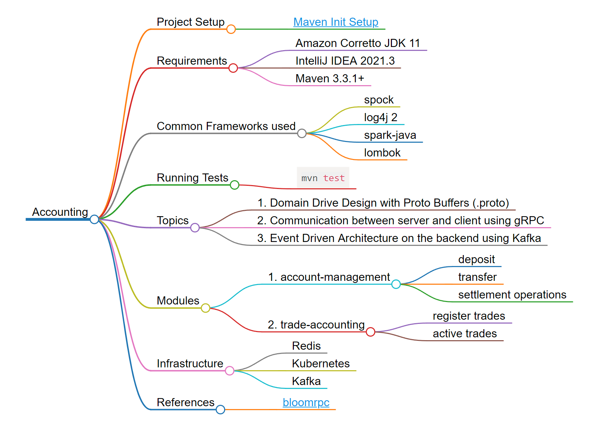

[](https://github.com/jorgegalveias/accounting/actions/workflows/maven.yml)
# Accounting
  This project regards accounting control functions of any enterprise.

## Project Setup
* [Maven Init Setup](https://maven.apache.org/guides/getting-started/maven-in-five-minutes.html)
## Requirements

* Amazon Corretto JDK 11
* IntelliJ IDEA 2021.3
* Maven 3.3.1+

## Common Frameworks used
* spock
* log4j 2
* grpc
* lombok

## Running Tests
```shell
mvn test
```

## Topics

 1. Domain Drive Design with Proto Buffers (.proto)
 2. Communication between server and client using gRPC
 3. Event Driven Architecture on the backend using Kafka

## Modules
 1. account-management
    * deposit
    * transfer
    * settlement operations
 2. trade-accounting
    * register trades
    * active trades
    
## Infrastructure
* Redis
* Kubernetes
* Kafka

## References
* [bloomrpc](https://github.com/bloomrpc/bloomrpc)
* [diagrams](https://mermaid-js.github.io/mermaid/#/) 
* https://github.com/Fadelis/grpcmock
## Diagram
  
  
